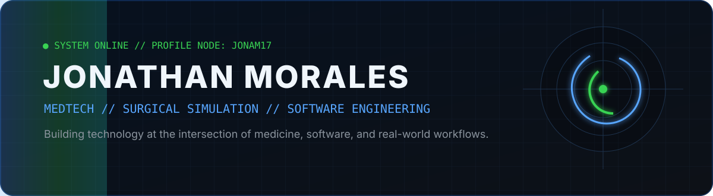
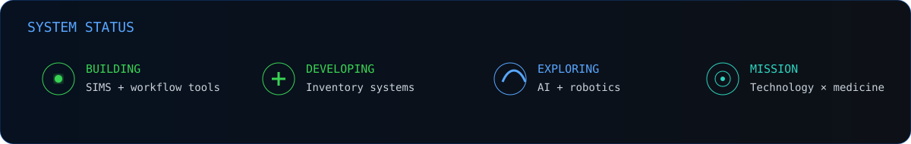
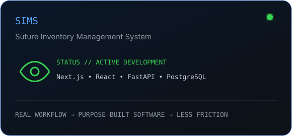

<div align="center">
  
  <br/><br/>
  <a href="https://github.com/jonam17"></a>
  <a href="https://stackoverflow.com/users/jona17"></a>
  
</div>

<br/>



## `01 // OPERATOR_PROFILE`

```yaml
name: Jonathan Morales
location: San Diego, California

domain:
  primary: MedTech & Surgical Simulation
  intersection:
    - Medicine
    - Software Engineering
    - Research
    - Automation

current_mission:
  - Build software for surgical simulation environments
  - Transform manual workflows into intelligent systems
  - Develop practical tools for healthcare and research
  - Explore robotics, data, and medicine

philosophy: "Build technology that solves real problems."
```

I work at the intersection of **medicine, technology, and software**. My background in biomedical research and surgical simulation gives me a perspective that extends beyond writing code: I build around **real operational problems, real users, and real workflows**.

---

## `02 // ACTIVE_SYSTEMS`

<div align="center">
  
  
  
  
</div>

---

## `03 // TECHNOLOGY_MATRIX`

<div align="center">
  
</div>

---

## `04 // ENGINEERING_PRINCIPLES`

| `01 // SOLVE REAL PROBLEMS` | `02 // DESIGN FOR HUMANS` | `03 // BUILD FOR RELIABILITY` | `04 // KEEP LEARNING` |
|---|---|---|---|
| Technology should eliminate friction. | Build systems people want to use. | Prefer maintainable systems over unnecessary complexity. | Every project expands the system. |

---

## `05 // TELEMETRY`

<div align="center">
  
  
  <br/><br/>
  
  <br/><br/>
  
</div>

---

## `06 // CONTRIBUTION_STREAM`

<div align="center">
  <picture>
    <source media="(prefers-color-scheme: dark)" srcset="https://raw.githubusercontent.com/jonam17/jonam17/output/github-contribution-grid-snake-dark.svg">
    <source media="(prefers-color-scheme: light)" srcset="https://raw.githubusercontent.com/jonam17/jonam17/output/github-contribution-grid-snake.svg">
    
  </picture>
</div>

---

## `07 // CURRENT_MISSION`

> **The most interesting problems exist between disciplines.**

I’m interested in building technology where **software leaves the screen and affects the real world** — especially in healthcare, surgical education, research, automation, and robotics.

---

## `08 // ESTABLISH_CONNECTION`

<div align="center">

`MEDTECH` • `SURGICAL SIMULATION` • `SOFTWARE` • `ROBOTICS` • `DATA`

<br/><br/>

<a href="https://github.com/jonam17"></a>
<a href="https://stackoverflow.com/users/jona17"></a>

<br/><br/>


</div>
